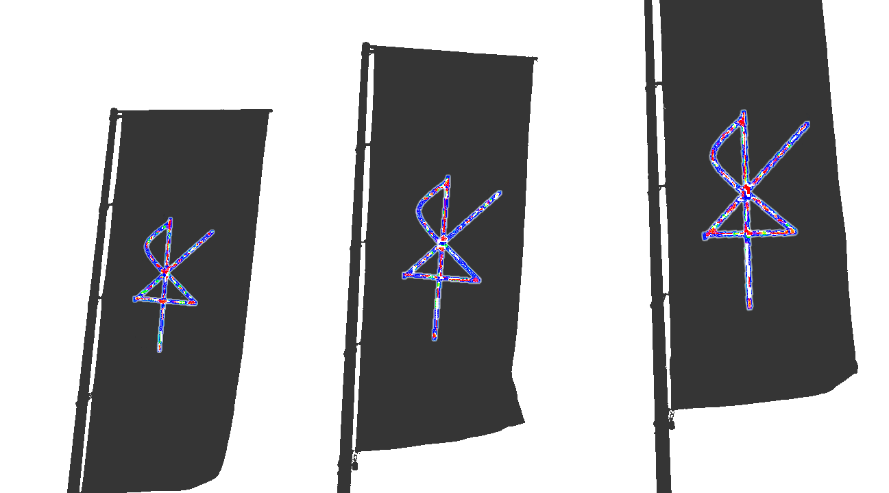

# xiq manifesto v0.1

_Refactoring multiscale human coordination by making woo compatible with modern ontologies and injecting it into society in a span of ~5 years_

> _Caveats, Hedging, and meta level stuff_
>
> - This is a doc about me and the way I see my life and the world. I put real effort into it in part because I didn't have a great way to communicate what I think I'm best at and most enjoy doing, which is making sense of the world and crafting metaphors that connect domains and ground them in a common framework with some level of epistemic and ontological rigor.
> - I hope this doc will reach people I’d like to collaborate with and make them more likely to receive whatever I make from now on. I also hope it can serve as context for future projects.
> - Another way I could look at why I’m doing this is as an exercise on how the things I want to do and talk about connect to me as a person and to my story and broader interests, because I think they're ultimately inseparable, and that subtle stuff like epistemology and phenomenology and ontology are hard to evaluate without getting a good sense of what their avatars are like.
> - Note, this is about getting a picture of what I’m like and what I’m doing across, not a full explainer of any of these concepts.

# Who am I, what am I doing, and why?

I'm xiq, I spend a lot of time on [twitter](https://twitter.com/exgenesis), and people like it when I make [computer metaphors to translate woo concepts](https://x.com/exgenesis/status/1322462839622291463).

It’s stuff like [explaining the holy trinity in terms of self-organization](https://x.com/exgenesis/status/1516127502166597632):

- the father as the abstract concept of agapic love,
- the son as its implementation in each of us,
- and the holy spirit as the emergent properties of a society where enough of us implement it, i.e. kingdom of god.

I think translation has a lot to do with analogy. In analogy you compare the abstract structure of two systems and perhaps find knowledge in each that may apply to both.

### 💬 My story a bit

Growing up my parents taught me to meditate and exposed me to spiritual contexts, but I initially favored a rationalist perspective. I learned about Descartes in high school and decided to rederive my whole ontology from “I think therefore I am”. I got stuck at love, which I accepted needed to justify itself in order to make sense (foreshadowing).

Then I studied computation, which I see as a fundamental language for understanding the world because it coincides with the decidable parts of math. Funnily enough, taking network science and machine learning courses in college made me appreciate fuzzy, probabilistic, and approximate knowledge and I began to trust my intuition and feelings much more as sources of information.

This expanded my scope of what domains of human activity may be valid despite being unscientific - including the unconscious, narrative archetypes, religion, and magic. Since at least parts of these seemed to influence the world, it was only natural to ask by what means they could do so.

There’s this tension between the parts of the world (groups of people, institutions, etc) that adhere strictly to scientific rational frameworks, and the knowledge that is present in wisdom traditions, but can’t travel across the gap between incompatible ontologies. I feel this tension viscerally and it compels me to trace an ontological critical path to be traveled by the lightning bolt that resolves it.

### 🧠 A bit of meta cognitive transparency

One factor of my compulsion may be that I like the models and meta-models of reality I’ve built up. I’ve been privileged to follow my curiosity and desires to attune to the world and to adaptively embed my experience in an overarching story. I also want to be more effective in the world and have more energy to do cool stuff, so I'm co-optimizing for learning and pragmatic value. [^1]

[^1]: My friend Tasshin says he trusts me because my heart leads my mind. I hope that's true but ultimately my heart is a pointer to my Eros and my whims when I'm attuned to the field around me.

To say a bit about why I think my sensemaking process can lead to decent models: I make an effort to validate formalisms with phenomenal[^2] and pragmatic[^3] experience, while at the same time reducing the space of possible interpretations of my subjective experience using the scientific method (in a Popperian sense). I am reasonably comfortable traveling across layers of abstraction, and think I've built up a decent ontology (or distribution of them[^4]) that allows me to pretty fluidly come up with explanations that are compelling to at least a few people on twitter. (lmao I know)

[^2]: When I say phenomenal I mean from investigating my subjective experience in meditation and feeling my body. Ultimately I consider subjective experience epistemic bedrock.
[^3]: When I say pragmatic I mean in terms of what makes me effective in pursuing my values in the world. Whether I feel good. Whether a model produces policies that produce experiences that align with my preferences.
[^4]: When I say distribution of ontologies, I mean in the meta-rational sense of holding many possible worldviews and applying them as appropriate, like lenses.

I’m a big fan of Buddhist phenomenology and the frameworks it offers. It’s astounding anyone would be able to figure it out in the first place, not to mention communicate it. My rough understanding of the three main branches of Buddhism is that Theravada aims at individual liberation, in Mahayana there’s the notion of compassion and how a bodhisattva takes on the enlightenment of all beings, and then I read a [David Chapman post](https://vividness.live/emptiness-zen-tantra-dzogchen) that led me to believe that in Vajrayana, you realize emptiness first and then you master doing cool shit in the world, for the benefit of all beings.

This to me resonates with the Ken Wilber catchphrase “Wake Up, Grow Up, Clean Up, Show up”, and as I say this I’m realizing I may have an Integral Theory-shaped gap in my reading, but I am at least tangentially familiar, albeit more with spiral dynamics than the rest of it.

Ok I want to attune to the world and care about doing cool shit. To me this sounds like doing art. Like making my life artful. And that doesn’t sound so different from maximizing flow state, like musicians and other people "in the zone". I want to feel that smooth laminar flow of adaptation at the edge of ability as I dissipate stress and transduce the energy around me into knowledge and comfort and play.[^5]

[^5]: A note on style: style would be influenced by my priors and tentatively defined as the regularities present in the most (thermodynamically) efficient way for that transduction to happen. My priors include my preferences and implicit beliefs which were kindly acquired through evolution and culture and my own fabulous self-curation.

The way I’m cultivating flow is through this notion of [Grace](https://open.substack.com/pub/xiqo/p/on-grace), or intervening further and further upstream in the causal chain. Calming my nervous system, metabolizing anxiety in the body, moving smoothly, relying progressively less on willpower, working smarter not harder, treating yourself and others with kindness by default, doing more of what I like and leaning into my strengths.

However, it's hard to gauge progress in this sort of thing, especially without teachers or belonging to a single tradition.[^6]

[^6]: As a sort of validation, I'm relearning the guitar from first principles, in the expectation that progress in concentration and insight will translate to more efficient learning. E.g. really paying attention to the way sound blends, building a close relationship between the felt-sense of chords and the music theory. Another validation is trying to see if these ideas I like spending time on can be of some use to anyone, or even communicated in the first place

### 🗺️ Strategy time

This cultivation of flow brings us to my concrete "career" conditions. I'm an ML and software engineer. I've worked on [dangerous capability AI evals](https://metr.github.io/autonomy-evals-guide/) and built [tools for thought for collective sensemaking](https://threadhelper.com/). But I'm not all in on these things. Compared to following my impulse to work on this woo-science translation, it feels effortful to compete with people to whom being all-in on AI comes easily.

I really think we'll see massive social change in the next ~5 years from integrating AI into the economy, but I don't think my highest marginal contribution would be in technical AI safety. I think one of my comparative advantages is relatively rigorous big-picture sensemaking[^7] and so I think I would benefit from researching stuff that’s further in the future. Other competitive advantages include having a reasonably chill nervous system and being good at relating, at least for a technical person.

[^7]: My evidence for this isn't that strong, and one thing I'd like to do is practice forecasting and see if I can establish a good record. In terms of evidence I've been early to many things that end up becoming super significant: crypto at 13 (~2010), AI in 2013, tpot in 2018/2019, and (even weaker) I usually seem to be able to contribute frames and sensemaking to people I consider very smart and capable and accomplished. One way to get some real feedback on this would be to take up forecasting which I kind of want to do.

Vibe-checking the AI safety scene this winter made me feel better about focusing on future scenarios where AI alignment is solved in practice, because there’s still plenty of work to do in those. A few topics that interest me there are: questions of disempowerment and wealth redistribution when AI replaces most labor, AI moral patienthood, and human teleology (what do we want) - all of which I believe wisdom traditions can contribute to.

I might return to building stuff later - possibly soon - but for now I want to go a little further with my special interest.

## How I see the world

I see humanity as this massive multi-scale holonic[^8] free-energy[^9] minimizer process[^10] with information flowing up and down the scales of human aggregation - senses, subconscious parts, individuals, dyads, squads, congregations, cities/networks, planetary, etc. Similar to how they’re described in [Microsolidarity](https://www.microsolidarity.cc/essays/five-scales-of-microsolidarity).

[^8]: A [holon](<https://en.wikipedia.org/wiki/Holon_(philosophy)>) is something that is simultaneously a whole in and of itself, as well as a part of a larger whole.
[^9]: The [free energy principle](https://en.wikipedia.org/wiki/Free_energy_principle#:~:text=The%20free%20energy%20principle%20is,world%20to%20enhance%20prediction%20accuracy.) is a theoretical framework suggesting that self-organizing systems reduce surprise - or prediction error of observations about their environments - based on internal models of their environments.
[^10]: I made a [diagram](https://x.com/exgenesis/status/1562059107233894402) a couple of years ago that illustrates this visually. My thinking has evolved since then so I would like to update this at some point.

Information goes up through subconscious sensing, introspection, interoception, communication, attunement, collaboration, alignment, organization, narrative, governance, science, markets (as well as unidirectionally via emotional diffusion, violence, exertion of power)

Information also goes down the scales thanks to top-down interventions that can be good for entities at lower scales[^11] in order to align incentives (to solve coordination problems like credible commitments or prisoner's dilemmas), but also arguably less good when they are actions of higher-order agents trying to protect their own integrity (e.g. nations recruiting for war, or companies protecting monopolies, etc) to the detriment of lower-order agents. (people)

[^11]: “Good” in the free-energy sense that it leads to states that accord with their preferences, which are encoded as priors in their generative models.

I say holonic free-energy minimizer in the sense that we can squint at groups of people at each scale and see nested entities that minimize prediction error by perceiving, learning, acting, planning, and balancing explore-exploit trade-offs. This frame lets us explain entities at different scales using the same language, allowing what would otherwise be separate perspectives to illuminate each other.[^12]

[^12]: This is too in-the-weeds to fully get into here but Active Inference (a special case of the free-energy principle that applies to organisms capable of action) reconciles self-organization (enactive), cybernetic (teleological) and predictive theories of behavior and cognition. (see T. Parr, 2022, Active Inference, Chap 3.7)

I think a lot of unsatisfactoriness in the world, or things we consider unpleasant like suffering and injustice and decreasing biodiversity, can be traced in good faith to suboptimal equilibria due to bad incentive structures (many of which may be changed with enough coordination) but also to problems in information transfer[^13] and aggregation[^14] at different scales. (in perception distortion, translation problems, bottlenecks in network topology, etc)

[^13]: Information transfer, or communication, necessarily contributes to coordination problems because if I am able to share the models behind my decisions I am more likely to succeed in explaining how our incentives align and thus enable cooperation. Improved communication also enables faster feedback loops and adaptation.
[^14]: Aggregating information like evidence to form a model of its generative process and thus better understand the world and how to react to it - or preferences to make decisions from.

Examples of problems:

- Top-level coordination: climate change; ai-risk; nuclear, chemical, biological, radiological risk;
- Individual and squad scale: atomization and lack of belonging;
- Inadequate interpersonal communication and emotional awareness and self-knowledge and metacognition;
- Lacking coordination at the Dunbar-scale with the decline of the church (not that they were doing a great job);
- Sub-optimal large-scale collective sensemaking like the current scientific academic ecosystem (formal), or the media / social-media landscape (informal).
- Lack of meaning or narrative about connection to a higher-order entity and/or a telos.
- Also non-1st-world problems like suffering, poverty, injustice, etc.

### A theory of change

I think most people come with the impulse to help their ingroup baked-in, we're social animals. Then comes the Christian prior that makes everyone ingroup, which is great.

However, some people (e.g. straw effective altruists, or my younger self) will try to [greedily optimize "helping" and "saving the world" at the expense of resources needed for their own well-being](https://forum.effectivealtruism.org/posts/AjxqsDmhGiW9g8ju6/effective-altruism-in-the-garden-of-ends#), especially towards causes that don't feed back into their lives very immediately. Ideally your contributions to society would be entangled with your own growth.

I believe in expanding concentric circles of care and attention. I think as you get your life in order and align your conditions with your needs - including subtle ones - you naturally overflow with energy which you will feel compelled to share with others.

My friend Rich believes in contributing to communities that nurture you at the same time - the two scales mutually bootstrapping - which I think is probably closer to the truth. "Do inner work to suffer less and have more energy; let excess energy overflow into service that hopefully matches your unique position; let the service of others improve your circumstances and enable you to serve more, etc"

Anyway, we could increase people’s capacity and well-being by making certain practices accessible to them. Things like different types of meditation (concentration, insight, metta, etc), self-therapy techniques (IFS, Focusing, Core Transformation, etc), and even more by cultivating Dunbar-scale spaces where they could form crews and groups of mutual support and growth, etc.

I think the fact that spiritual, religious, and wisdom traditions have been important for so long and for so many people is good evidence that they contain useful knowledge about the world and their domains of activity - self-knowledge, subtle communication, Dunbar-scale coordination, teleology, etc. I think these overlap decently with bottlenecks in the holonic sensemaking apparatus, even if they don't they don't completely cover them. [^15]

[^15]: For example, I believe in technological solutions for preference aggregation, large-scale organizing, etc. I also believe in the role of technology for automating much of wisdom generation - from all kinds of AI instruction and assistance in self-reflection and communication and learning about the world, to neurotech like biofeedback helmets to assist meditation practice, and other synthetic sensors and actuators.

This knowledge is often encoded into practice, psycho-social technologies if you will. I think that updating these to our current predicaments, possibly even improving them with modern scientific knowledge (biology, psychology, social systems, complex networks, etc) could help us improve the fidelity of information apprehension and aggregation at bottlenecks along the social aggregation scales and help with many of our problems.

## What I want to do

I believe we can refactor multiscale coordination by naturalizing woo and plugging it into the default worldview.

Grass-roots society could be transformed if we deliver the wisdom in punchy memes via TikTok or whatever medium is prevalent at the time. Persuading prestige classes of these ideas leads to even more science and technology leveraging woo, leading to even more effective dissemination.

I want to coax the lightning of knowledge in the clouds of wisdom traditions to STRIKE our scientific-rational ground; and by striking, disclose this wisdom to people who otherwise wouldn't allow themselves to entertain certain practices because their workings aren't transparent to rational-materialist lenses. [^16]

[^16]: We can think of this translation effort as a meta-systematic move to patch a "single-systematic" society.

Conversely, opening up a translation pathway between woo and science would allow us to apply scientific resources and conceptual scaffolding to - where possible - distill, improve, strengthen practice from wisdom traditions.

Finally, this translation may allow wholesome practices and worldviews to permeate both from grass-roots and institutionally and change approaches to "problems" in many subtle ways.

I hold this big-picture intention, but I am still researching and evaluating concrete high-leverage interventions to focus on. Ideally I'd be able to either join or establish a community of practice that is at a similar page and doing complementary work. For now the best course of action I have is communicating where I'm coming from in this document and reaching out to people I resonate with who are working on similar things.

I know for a fact many people are working on resonant or overlapping projects, and the [“theory of everything” podcast sphere](https://www.youtube.com/@TheoriesofEverything) is already active. People with big ideas are already talking, but I still feel a gap in explicit object-level coordination and prioritization. I could see roles of remote project coordination (via something like the [Facilitator’s Catechism](https://zenodo.org/records/4579414#.YVMj5JrMKUk)) and ecosystem stewardship (something that looks like [coordinated research program leadership](https://spec.tech/library/research-leaders-playbook), with much lower funding ability) emerging soon.

## Aspects of the woo-science duality

This section details three frames I often find really useful. It is a bit lower polish than the rest but I thought I should include it because they sort of map to the woo-science duality - or more weakly - are instances of some yin-yang, expansion-contraction, S1-S2, sympathetic-parasympathetic duality and seem relevant to the overall project.

### Enlightened self-interest (selfishness 🤝 selflessness)

I think it's possible to reconcile pro-social behavior with a game-theoretic lens on socialization.

The usual way enlightened self-interest goes is by realizing that being known as a good person is advantageous and the simplest way to get that reputation is to be a good person.

I like to add specificity to the last part - "be a good person" - where even if you don't have a prior for "identifying with the collective", you would do well if you adopt it (by faking it til you make it, by convincing yourself rationally, by cultivating metta, etc), because it's the very simplest way to ensure you spend minimal resources in implementing all that good behavior.

Slightly unnecessary but a nice vignette: Most (healthy) people gradually identify more and more with the collective as they age, losing optionality, becoming more supportive of young ones and the fabric of society, until they become an old tree supporting the forest with shade and shelter and organic mass, etc.

I find that by holding metta and more or less following the path of least resistance you get a pretty solid ethical policy day-to-day. However, you still need an immune system, otherwise you'll incentivize defector behavior. I think it's important to have a security mindset, where you analyze your vulnerabilities and how much potential others have to hurt you and adapt or renegotiate accordingly.

Reading _[The Elephant in the Brain](https://www.goodreads.com/en/book/show/28820444)_ helped me realize how unconscious to their own strategies people can be, and that really helps maintain compassion instead of antagonizing. I like to assume the best about people's intentions, while still defending my game theoretic position and making bids that are fair for both parties.

### Body (and subconscious) vs conscious mind

- This maps roughly to the S1/S2, right brain/left brain dualities. I think the connection with woo/science is obvious.
- Recognizing the unconscious as a powerful force the mind should acknowledge and work with just improved my life in many ways.
- Joscha Bach sees the role of the propositional conscious mind as more of a debugger that should be sparsely active in a thriving system, and I find that really compelling. It's a more general, finer-grained processor to which errors are escalated from the coarser but much faster dedicated circuits of the body. [Mike Johnson](https://x.com/johnsonmxe/status/1731825339922624778) also talks about organs emitting error codes that are resonant modes that then incentivize behavior to resolve them.
- Mike’s [Principles of Vasocomputation](https://opentheory.net/2023/07/principles-of-vasocomputation-a-unification-of-buddhist-phenomenology-active-inference-and-physical-reflex-part-i/) suggests a compelling grounding for the Buddhist concept of tanha by explaining it as “unskillful active inference”, as the cost of the brain holding predictions (intentions) that can’t hold and thus have a cost. According to the piece, these predictions are held in smooth muscle latches that constrain the harmonic modes of oscillation of the nervous system. In my view, it also grounds the phenomenology of “energy” and stress patterns in the body, in addition to being a prime example of the kind of work I’m advocating for.

### Collective unconscious as a plane of existence (like cyberspace)

One way to conceive of the collective unconscious is as an actual plane where things happen. It's running on the eventually consistent distributed network of individual human subconscious, sparsely syncing in conversation and subtle interaction. It's an aggregate version of all latent spaces.

We can imagine dynamics in this space. Memes will have different propagation patterns based on people's biases, symbolism, stress dissipation ability, etc. We can entertain the lifecycle of egregores, tulpas, and other self-organizing patterns.

The best ways we have to look into this space have been google trends, tracking memes, and now exploring semantic space in LLMs which reflect a huge portion of our collective unconscious in pretty accessible ways but they still work more like snapshots instead of a real-time interface to the thing.

I think it's definitely possible to gain truer sight into this space, especially with an alliance of AI and a better theory of memes, archetypes, narrative, etc. I think by understanding it better we could more intentionally craft stories and deliver them in a fashion adapted to the recipients, and terraform the place! (unclear if we would want to, what responsible policy there would look like, I imagine there is such a thing as diversity of psycho-flora and psycho-fauna that we would want to conserve)

## A few frameworks I like

This section is also pretty low effort but I wanted to explicitly dog whistle a few lenses I like to take often and changed my life to some degree.

- _Network science_: There are networks in most domains - in ecosystems, gene networks, social networks, supply chains, telecommunication, transport, molecules, games, belief propagation, pandemics, etc - and it’s mind-blowing that we can study their properties in abstract and say so much about robustness, criticality, cascading and spreading phenomena, etc.
- _Free energy principle and active inference_: a normative framework to understand behavior, cognition, and optimization of agents at various scales in terms of a single value - free energy (or prediction error).
- _Buddhist phenomenology_: rigorous investigation of subjective experience and the mind leading to freedom from suffering and higher coupling to the world (lower prediction error).
- _Evolutionary psychology_: helps explain social behaviors and generates compassion for seeming irrationality.
- _Relevance Realization_ and John Vervaeke’s articulation of the history of philosophy and meaning in Awakening from the Meaning Crisis. (not exactly a framework but important to me nonetheless)
- _Wolfram's hypergraph rewriting_: a low-level, computational, potentially unifying framework for fundamental physics.
- _Landauer's principle and Information Theory_: establishes that information is physical, grounding a lot of potentially hard to account for spiritual stuff.
- _Enlightened self-interest_: being completely self-interested can still result in altruistic actions.
- _Qualia Physicalism_: I think the [Qualia Research Institute](https://qri.org/research-lineages) presents beautiful examples of grounding traditions historically outside the domain of science - like psychedelic and Buddhist phenomenology.

## Conclusion

This is me! Just a guy compelled to refactor multiscale human coordination by making woo compatible with modern ontologies and injecting it into society in a span of ~5 years.

A few challenges and risks might be in balancing the ambitious and potentially grandiose nature of this project with the need for a manageable scope, as well as lack of experience leading large-scale research efforts. (lol)

Anyway here are a few take-aways from the whole thing!

1. To unlock human potential, improve inefficiencies and bottlenecks in sensemaking, information flow, and aggregation across the scales of society.
2. Spiritual, religious, wisdom traditions hold a lot of real value that could be enjoyed and built upon if the ontological translation to the scientific frame was made.
3. I’m looking for high-leverage ways to deepen or apply these ideas. I am also looking for others who resonate with my approach and are working on similar or complementary problems. If this is you, reach out, I always enjoy triangulating the hyperobject!
4. This is an earnest quest and work in progress. I’m following my curiosity, experimenting with frameworks, and aiming to contribute however I can. I welcome feedback and critique :)

And that’s it. Now we can start manifesting a world where we made the translation, plugged it into society in ways adapted to most niches, people became really good at introspection and emotional processing, collective sensemaking improved with clearer pictures of our shared latent realm, everyone is vibing, there’s good science, art, play which expand the diversity of positive valence states of consciousness and lead us to eventually colonize the stars exactly like in Star Trek

:p
